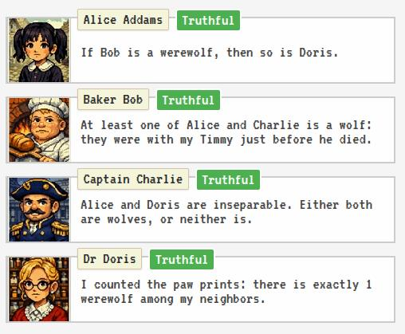

# Who's a wolf

A find-the-werewolves, knights-and-knaves style puzzle game. A group of villagers make statements, some of them are lying werewolves, and one is a lying non-werewolf shill. The goal is to determine who is a honnest villager, who is the shill, and and who are the werewolves.

## Code organization

- [puzzle_generation](./puzzle_generation/) contains the code to generate the puzzles (i.e. finding states of statements with a unique solution to the problem), and analyze them for bias etc.
- [asset_generation](./asset_generation/) contains the AI-generated character sheets and a script to extract the assets from them.
- [app](./app/) contains the code for the web app (Svelte)
